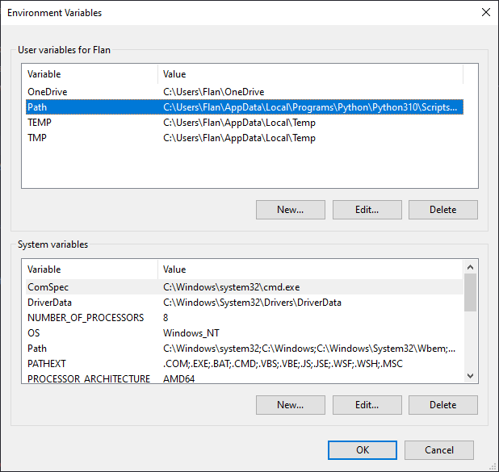

# Installer l'application 


## Dépendances

### Installation du .Net Framework

Afin de pouvoir compiler le projet, vous aurez besoin du Framework .NET en version `4.7.2`.
Vous pouvez le télécharger le runtime [ici](https://dotnet.microsoft.com/en-us/download/dotnet-framework)

#### Ajouter `msbuild` au variable de chemin

Vous devrez ajouter la command msbuild au chemin d'access.
L'executable `msbuild` se trouve dans le dossier `C:\Windows\Microsoft.NET\Framework\[Version]\msbuild` 
ou `C:\Program Files\Microsoft Visual Studio\[Year]\Community\MSBuild\Current\Bin` si vous avez installé `.Net Framework` en utilisant visual studio.

Une fois le chemin de l'executable `msbuild` trouvé, copie ce dernier dans le presse-papier.

Ouvrez le menu d'édition de variables system. Vous pouvez chercher `path` dans le menu windows et cliquer sur le lien suivant:


Depuis ce menu, cliquer sur le button `variables d'environment`


Ensuite, ciquer sur `Path` puis Editer:



Cliquez alors sur `Ajouter`:


Enfin coller le chemin que vous avez copié précédement.
Faites attention à ce que celui-ci finisse par `msbuild.exe`.


Vous devriez pouvez à présent utiliser la commande `msbuild` dans votre ternminal.

### Serveur de Gestion de Base de données pour MySQL

Il est recommandé d'utiliser un serveur linux afin d'installer une base de données mysql.
Cependant il est possible d'utilise [wamp](https://www.wampserver.com/en/download-wampserver-64bits/)
ou [laragon](https://laragon.org/) afin d'avoir une instance sur votre ordinateur.


### Python

Afin de générer le jeu de données, il vous faudra avoir Python d'installé dans sa version `3.10`

Allez sur le [site officiel de python](https://python.org)

puis dans la section `Download`, `All realase`.
Dans le tableau en desous de `Looking for a specific release?`,
prenez sur le premier lien disponible pour la version de python `3.10.x`.

Descendez en bas de la page au niveau du tableau en dessous de `Files`
et télécharger la version de python qui correspond à votre machine.

Lorsque vous installerez Python, n'oubliez pas de l'ajouter au variables de chemin.

## Télécharger le projet

Si vous possédez git, utiliser la commande 

```bash
git clone https://github.com/Rushulyte/Fulbank
```

Sinon cliquez sur le boutton de téléchargement sur le repository Github.


## Base de données

### Installation

Dans le dossier `db`, executer le script d'installation SQL nommé `seeder.sql`.

### Ajout des données

#### Création du fichier `.env`

Dans le dossier `db/feeder` du projet, copier le fichier `.env.exemple` et coller le en l'appelant `.env`.
Si le ficher `.env.exemple` n'apparait pas, activer les fichers cachées dans l'exporer de ficher windows.

Remplissez ce fichier avec les information de la base de données.

#### Lancement du feeder

Utiliser python pour executer le programme `main.py`.

```py
python db/feeder/main.py
```

Selon l'installation de python, la commande peut aussi être 

```py
py db/feeder/main.py
```


## Application

### Ajouter les données de connexion

Dans le fichier `Database.cs` situé dans le dossier `src/Fulbank/Classes/`, éditer les variables de connexion à la base de données 

```cs
_db = "fulbank";
_user = "root";
_psswd = "''";
_host = "localhost";
```

### Compilation

Uiliser la commande suivante afin de compiler l'application. Cette dernière peut prendre une trentaine de secondes.

```cmd
msbuild src/Fulbank/Fulbank.csproj /p:Configuration=Release  /t:rebuild /clp:ShowCommandLine
 ```

L'executable ce site dans le dossier `src/Fulbank/bin/Release`.